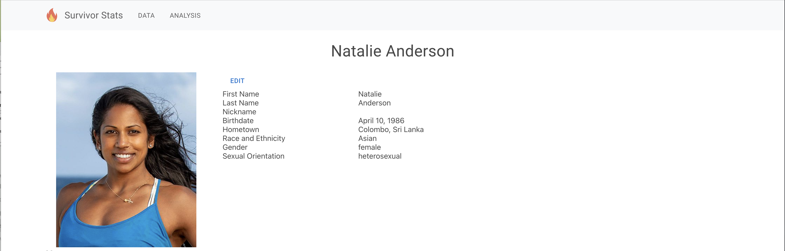
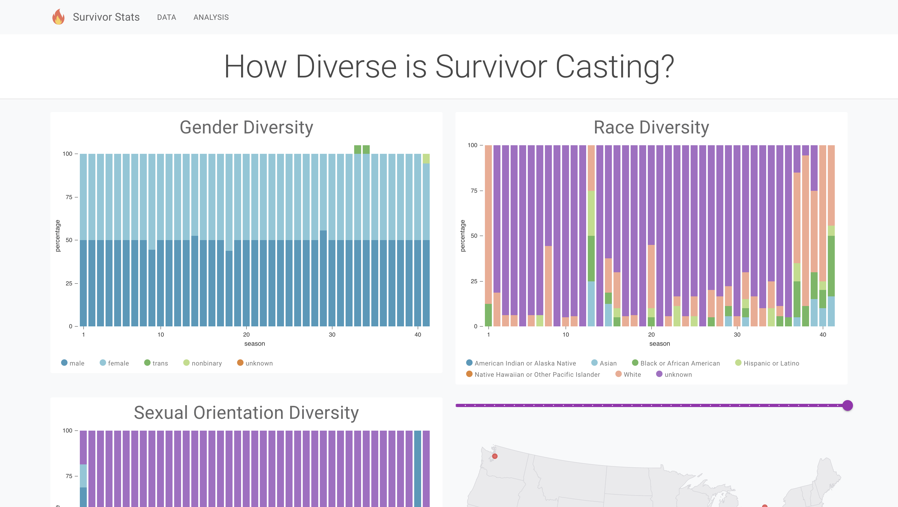
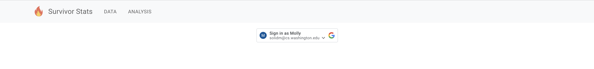
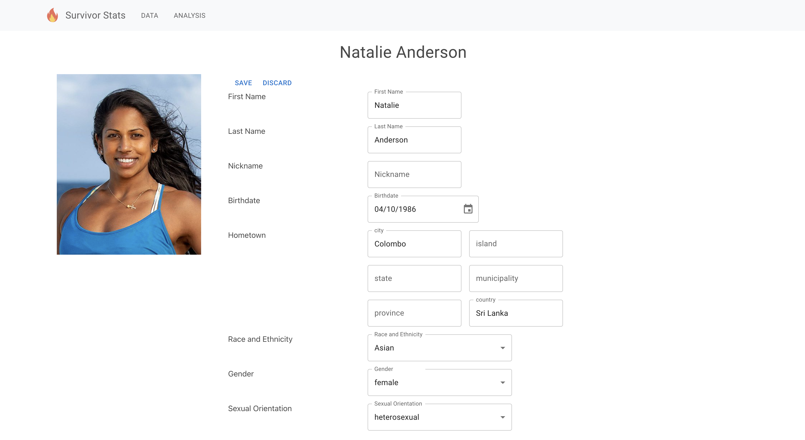

# Survivor Stats Website
A single-page application that displays, edits, and analyzes data pertaining to
the hit reality TV show Survivor.

Built on React and MUI libraries.

A version is up and running at: [https://survivorstats.herokuapp.com/](https://survivorstats.herokuapp.com/)
(You may experience higher than usual latency because of the web server,
backend server, and database being hosted in far locations on free accounts
with low performance.)

## Functionality

### View Season Data

### View Contestant Data

### View Analysis of Data

Each analysis page analyzes a specific question by using data visualization.
Currently, there is only one analysis page as an example, but ideally more would
be added in the future.

### Sign In with GoogleSignin

Sign in with Google to access data manipulation features. After signing in, You
will only be able to access these features if your google account has already
been approved for an admin role. Since only admins need to sign in, the page is
not accessible from the navigation bar. You can access the page at the
**/signin** path.

### Edit Contestant Data

Only an admin who has signed in via the sign-in page can edit contestant data.
To view this edit feature (but still be unable to submit edits), add the cookie
**canEdit = true**.  

## Features

### Responsive
The UI adapts to screen size and viewport, providing a good experience across
multiple devices.

### Accessible
Data visualization colors are selected to also be discernible by those who are
color blind.

## Future Improvements
1. Optimized images
2. Server-side logging
3. Automated tests

## Available Scripts

In the project directory, you can run:

### `npm start`

Runs the app in the development mode.\
Open [http://localhost:3000](http://localhost:3000) to view it in the browser.

The page will reload if you make edits.\
You will also see any lint errors in the console.

### `npm test`

Launches the test runner in the interactive watch mode.\
See the section about [running tests](https://facebook.github.io/create-react-app/docs/running-tests) for more information.

### `npm run build`

Builds the app for production to the `build` folder.\
It correctly bundles React in production mode and optimizes the build for the best performance.

The build is minified and the filenames include the hashes.\
Your app is ready to be deployed!

See the section about [deployment](https://facebook.github.io/create-react-app/docs/deployment) for more information.

### `npm run eject`

**Note: this is a one-way operation. Once you `eject`, you can’t go back!**

If you aren’t satisfied with the build tool and configuration choices, you can `eject` at any time. This command will remove the single build dependency from your project.

Instead, it will copy all the configuration files and the transitive dependencies (webpack, Babel, ESLint, etc) right into your project so you have full control over them. All of the commands except `eject` will still work, but they will point to the copied scripts so you can tweak them. At this point you’re on your own.

You don’t have to ever use `eject`. The curated feature set is suitable for small and middle deployments, and you shouldn’t feel obligated to use this feature. However we understand that this tool wouldn’t be useful if you couldn’t customize it when you are ready for it.

## Learn More

You can learn more in the [Create React App documentation](https://facebook.github.io/create-react-app/docs/getting-started).

To learn React, check out the [React documentation](https://reactjs.org/).

### Code Splitting

This section has moved here: [https://facebook.github.io/create-react-app/docs/code-splitting](https://facebook.github.io/create-react-app/docs/code-splitting)

### Analyzing the Bundle Size

This section has moved here: [https://facebook.github.io/create-react-app/docs/analyzing-the-bundle-size](https://facebook.github.io/create-react-app/docs/analyzing-the-bundle-size)

### Making a Progressive Web App

This section has moved here: [https://facebook.github.io/create-react-app/docs/making-a-progressive-web-app](https://facebook.github.io/create-react-app/docs/making-a-progressive-web-app)

### Advanced Configuration

This section has moved here: [https://facebook.github.io/create-react-app/docs/advanced-configuration](https://facebook.github.io/create-react-app/docs/advanced-configuration)

### Deployment

This section has moved here: [https://facebook.github.io/create-react-app/docs/deployment](https://facebook.github.io/create-react-app/docs/deployment)

### `npm run build` fails to minify

This section has moved here: [https://facebook.github.io/create-react-app/docs/troubleshooting#npm-run-build-fails-to-minify](https://facebook.github.io/create-react-app/docs/troubleshooting#npm-run-build-fails-to-minify)
